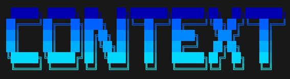

<p align="center">
  
</p>

<p align="center">
  <a href="https://www.npmjs.com/package/context-mcp-server"></a>
  <a href="https://www.npmjs.com/package/context-mcp-server"></a>
  <a href="LICENSE"></a>
  <a href="package.json"></a>
</p>

Persistent memory and codebase knowledge graph for AI coding assistants — delivered as a single MCP server.

One shared context store across Claude Code, Cursor, Gemini CLI, Codex, Windsurf, VS Code Copilot, Claude.ai, and ChatGPT. Save context from one AI, pick it up in another.

---

## The Problem

Every conversation with an AI assistant starts from zero. The AI re-reads files it already read yesterday, re-discovers architecture it already understood, re-derives decisions that were already made. You repeat context. You paste the same background.

This gets worse as projects grow — reading 20 files to answer "what calls this function?" burns thousands of tokens every time.

---

## What It Solves

- **Persistent memory** — decisions, bugs, notes, and config saved across sessions, loaded automatically at conversation start
- **Shared store** — `~/.context-mcp/projects/<name>/` per-project on your machine; all AI tools read and write it
- **ContextGraph** — build a knowledge graph of your codebase once, answer structural questions in ~500 tokens instead of ~50,000

Real measured reduction on this project: **162× fewer tokens**, **99.38% reduction** per conversation.

---

## Installation

```bash
npm install -g context-mcp-server
```

Requires Node.js ≥ 18. Installs `context-mcp`, `context-mcp-http`, and the `ctx` CLI.

**ContextGraph requires [uv](https://docs.astral.sh/uv/)** (Python runner). Memory tools work without it.

```bash
# macOS / Linux
curl -Ls https://astral.sh/uv/install.sh | sh

# Windows
winget install astral-sh.uv
```

---

## Quick Start

Run from your project root:

```bash
ctx install --initial
```

This installs Node.js + Python (ContextGraph) dependencies. Run once after installing the npm package.

Then write MCP config + AI instruction files:

```bash
ctx install --all
```

To install for a specific platform only:

```bash
ctx install --claude      # Claude Code
ctx install --cursor      # Cursor
ctx install --vscode      # VS Code Copilot
ctx install --gemini      # Gemini CLI
ctx install --codex       # Codex CLI
ctx install --windsurf    # Windsurf
```

For web clients (Claude.ai, ChatGPT), start the HTTP server:

```bash
ctx online               # start in background, prints OAuth credentials + URL
ctx online --restart     # force restart
ctx online --port 3200   # different port
```

---

## CLI Reference

Both `ctx` and `context` are aliases for the same CLI.

```bash
ctx                            # interactive mode (UI)

# Context
ctx list [project]             # list entries by tree: graph / context / summary / plans
ctx projects                   # all projects with graph status + recent entries
ctx search "query"             # keyword → semantic fallback search
ctx add                        # add entry interactively
ctx summary [project]          # summarize recent entries

# Delete
ctx delete <id-prefix>         # delete one entry
ctx delete project <name>      # delete all entries for a project

# Server
ctx online                     # start HTTP server (idempotent)
ctx online --restart           # force stop + restart
ctx settings                   # view and edit config interactively

# Tools
ctx benchmark                  # token savings report (memory + graph)
```

---

## Security

File and git tools are sandboxed to your project root. Pass `rootPath` when calling `context.resume`:

```json
{ "action": "resume", "project": "my-app", "rootPath": "/home/user/my-app" }
```

Any file or git operation outside that directory is rejected. Applies to all HTTP-connected clients.

---

## Features

### Memory

- `context.resume` — loads recent entries, active plans, and graph status; registers `rootPath` for sandboxing
- `context.save` — store context with 4 types: `decision`, `bug`, `note`, `config`
- `context.get` / `context.update` / `context.delete` — full CRUD, single or batch
- `search` — keyword-first, semantic fallback
- `plan` — auto-triggered when AI makes any plan; saves a markdown summary to a `planDir` you specify
- Auto-deduplication on save; auto-compact at 20 entries → stored in `summary.json`

### ContextGraph

> Also called **CodeGraph**. MCP tools use the `codegraph_*` prefix — both names mean the same thing.

**Step 1 — Build** (once per project, runs locally, no API cost):

```
codegraph_build(path)
```

Parses codebase via tree-sitter AST (16 languages, regex fallback). Extracts functions, classes, imports, call edges. Build metadata saved to `~/.context-mcp/projects/<name>/graph.json`.

**Step 2 — Query** (instant, forever):

```
codegraph_query(path, question?, node?)   → structural question OR single-node lookup (or both)
codegraph_path(path, from, to)            → shortest path between two concepts
codegraph_nodes(path, type)               → list all nodes of a type
codegraph_report(path)                    → god nodes, clusters, surprising connections
```

`codegraph_query` accepts `question` (natural language), `node` (exact/partial name for type + file + deps + callers), or both in one call. Use before reading any files.

### File & Git Tools

Available to HTTP-connected clients (Claude.ai, ChatGPT). Local AI clients use their native IDE tools.

- `read_file`, `write_file`, `patch_file`, `create_dir`, `list_dir`, `delete_file`
- `git_status`, `git_diff`, `git_log`, `git_add`, `git_commit`, `git_push`, `git_pull`, `git_branch`, `git_stash`, `git_reset`, `git_show`

Enable git tools with `--access-git` flag or `access_git: true` in config.

---

## Server Flags

```
context-mcp [--data-dir <path>]

context-mcp-http [--port <number>] [--host <string>] [--access-git] [--data-dir <path>]
```

Default port: `3100`. Default data dir: `~/.context-mcp`.

---

## Config Reference

`~/.context-mcp/contextconfig.json` — auto-created on first run:

| Field | Default | Description |
|-------|---------|-------------|
| `client_id` | `"context-mcp"` | OAuth client ID |
| `client_secret` | auto-generated | OAuth signing secret |
| `port` | `3100` | HTTP server port |
| `host` | `"localhost"` | HTTP bind host |
| `access_git` | `false` | Enable git tools for HTTP clients |
| `public_url` | `null` | Public URL for `ctx online` output |
| `allowed_redirect_uris` | `["https://claude.ai"]` | OAuth redirect URI whitelist |
| `allowed_origins` | `[]` | Extra CORS origins |

Edit with `ctx settings`.

---

## License

MIT
